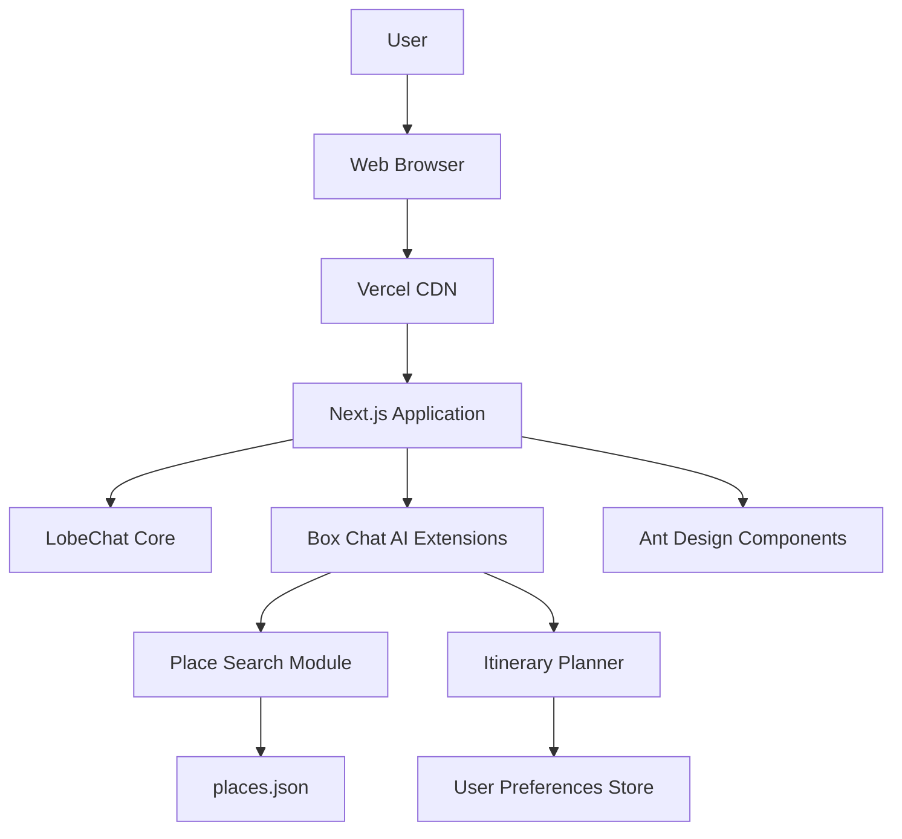
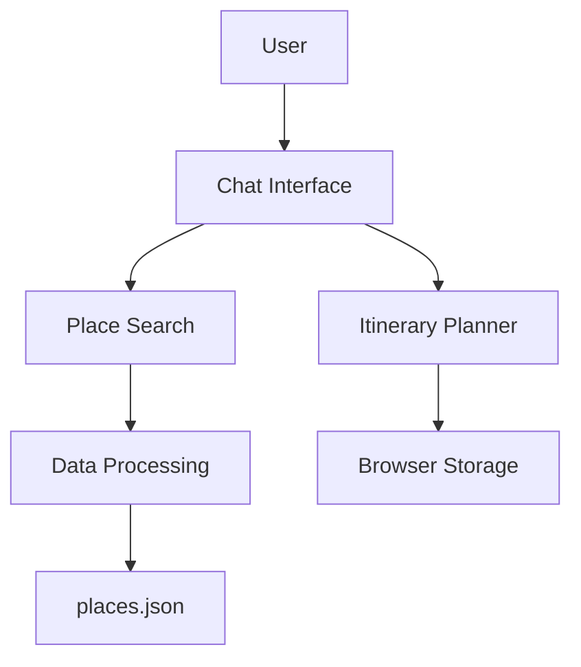
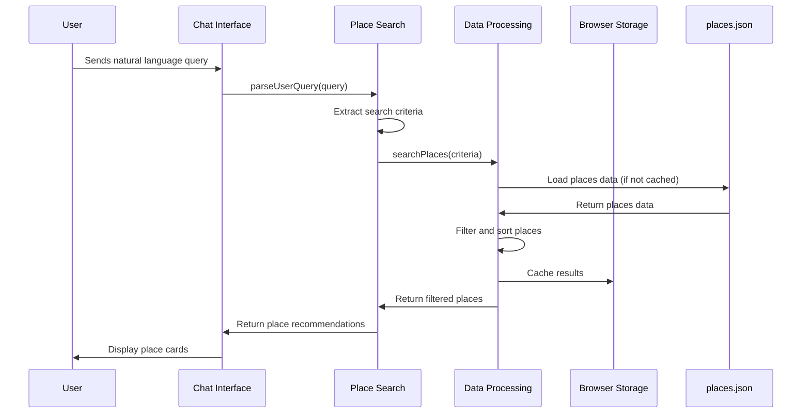
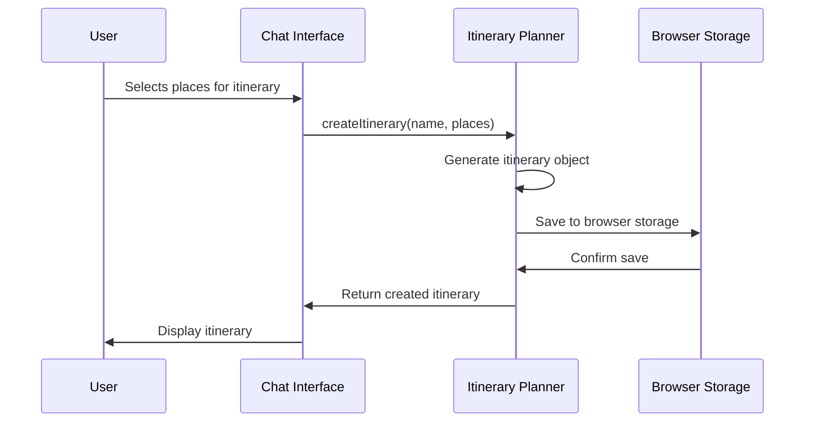
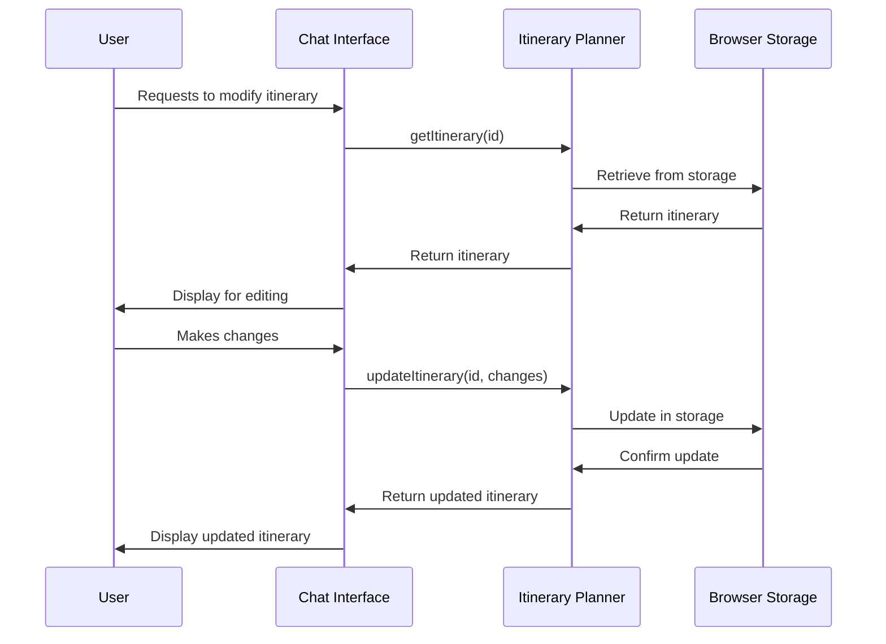
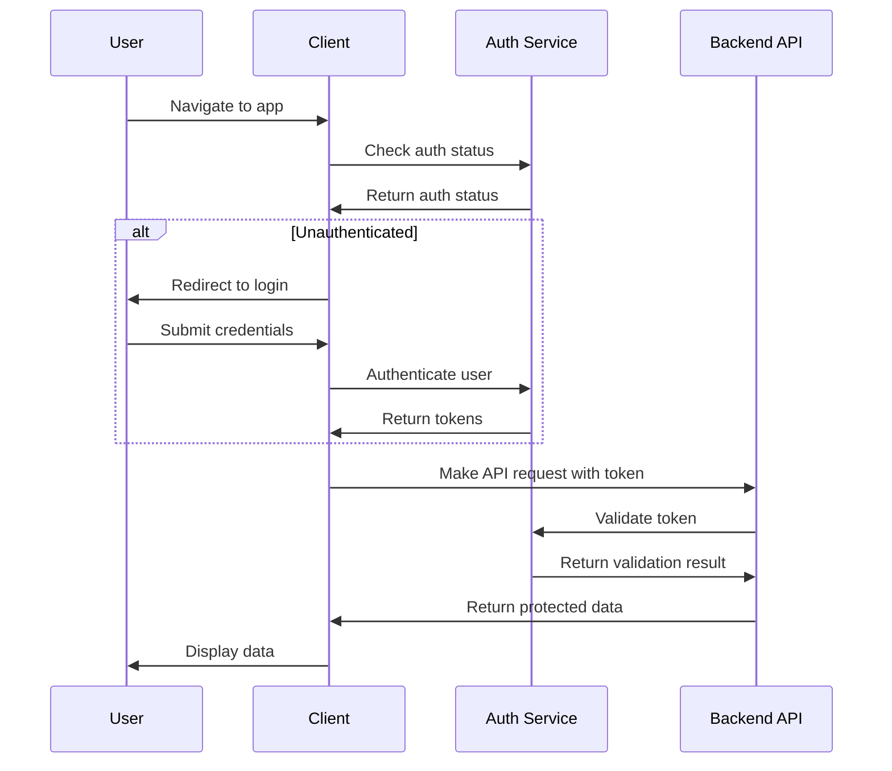
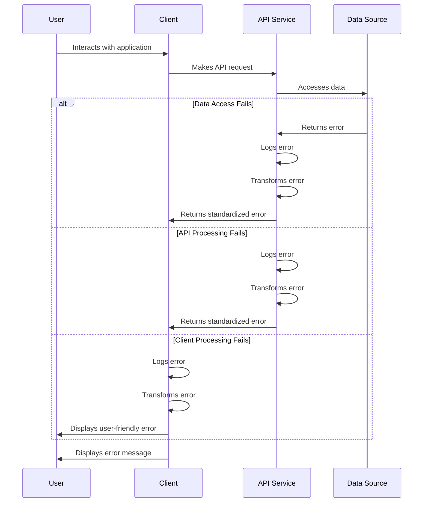

# Fullstack Architecture Document: Box Chat AI

## Introduction

This document outlines the complete fullstack architecture for Box Chat AI, including backend systems, frontend implementation, and their integration. It serves as the single source of truth for AI-driven development, ensuring consistency across the entire technology stack.

This unified approach combines what would traditionally be separate backend and frontend architecture documents, streamlining the development process for modern fullstack applications where these concerns are increasingly intertwined.

### Starter Template or Existing Project

Box Chat AI is built upon the existing LobeChat platform, which provides a solid foundation for building AI-powered chat applications. LobeChat is an open-source, modern design ChatGPT/LLMs UI/framework that supports speech synthesis, multi-modal, and extensible Function Call plugin system.

**Rationale:** Building on LobeChat provides several advantages:
- Existing chat interface that users are already familiar with
- Support for multiple AI providers (OpenAI, Anthropic, Google, Ollama, etc.)
- Plugin system for extensibility
- Responsive design that works on both desktop and mobile
- Existing deployment infrastructure on Vercel

**Constraints:**
- Must maintain compatibility with existing LobeChat features
- Architecture decisions must align with LobeChat's existing structure
- Need to carefully integrate new functionality without breaking existing features

### Change Log

| Date | Version | Description | Author |
|------|---------|-------------|--------|
| 2025-08-28 | 1.0 | Initial architecture document | Winston (Architect) |

## High Level Architecture

### Technical Summary

Box Chat AI leverages the existing LobeChat platform as its foundation, extending it with place recommendation and itinerary planning capabilities. The architecture follows a client-side only approach for the MVP, with all data processing happening in the browser. The frontend is built with React/Next.js and Ant Design, maintaining consistency with LobeChat's existing UI patterns. Key integration points include the chat interface for natural language input, place card components for displaying recommendations, and itinerary management components for planning. The application will be deployed on Vercel, taking advantage of LobeChat's existing deployment infrastructure. This architecture achieves the PRD goals by providing an intuitive interface for discovering places and creating travel itineraries through natural language interaction.

### Platform and Infrastructure Choice

Based on the PRD requirements and technical assumptions, we'll continue using Vercel as the deployment platform since it's already used by LobeChat. For data storage, we'll use the existing file-based approach with `places.json` stored as a static asset.

**Platform:** Vercel
**Key Services:** 
- Vercel for frontend hosting and serverless functions
- Static file serving for `places.json`
- Vercel Analytics for basic monitoring

**Deployment Host and Regions:** 
- Vercel's global CDN for optimal performance
- Edge functions for any serverless backend needs in future phases

**Rationale:** This approach aligns with LobeChat's existing infrastructure and the MVP's client-side only requirement. It minimizes complexity and development time while leveraging the proven scalability of Vercel's platform.

### Repository Structure

The repository structure will follow LobeChat's existing monorepo approach with some additions for Box Chat AI specific functionality.

**Structure:** Monorepo based on LobeChat's existing structure
**Monorepo Tool:** pnpm workspaces (as used by LobeChat)
**Package Organization:**
- `/apps/web` - Main web application (LobeChat with Box Chat AI extensions)
- `/packages/*` - Shared packages from LobeChat
- `/data` - Location for `places.json` and any other data files
- `/docs` - Documentation including this architecture document

### High Level Architecture Diagram



### Architectural Patterns

- **Component-Based UI:** Reusable React components with TypeScript - _Rationale:_ Maintainability and type safety across large codebases, consistent with LobeChat
- **Client-Side Data Processing:** All data processing happens in the browser - _Rationale:_ Aligns with MVP requirement for no backend and leverages LobeChat's existing architecture
- **Chat-Driven Interface:** Natural language input through chat interface - _Rationale:_ Leverages LobeChat's core strength and provides intuitive user experience
- **State Management Pattern:** Zustand for global state management - _Rationale:_ Already used by LobeChat, provides simple and scalable state management

## Tech Stack

### Technology Stack Table

| Category | Technology | Version | Purpose | Rationale |
|----------|------------|---------|---------|-----------|
| Frontend Language | TypeScript | ^5.8.3 | Type-safe JavaScript development | Already used by LobeChat, provides type safety and better developer experience |
| Frontend Framework | Next.js | ~15.3.5 | React-based framework for production apps | Already used by LobeChat, provides SSR, SSG, and API routes |
| UI Component Library | Ant Design | ^5.26.6 | UI components for React | Already used by LobeChat, provides comprehensive component set |
| State Management | Zustand | 5.0.4 | Simple, scalable state management | Already used by LobeChat, lightweight and easy to use |
| Backend Language | TypeScript | ^5.8.3 | Type-safe JavaScript development | Consistent with frontend, no separate backend for MVP |
| Backend Framework | Next.js API Routes | ~15.3.5 | Serverless functions for backend logic | Already available in LobeChat, no separate backend for MVP |
| API Style | REST API | N/A | Communication between frontend and backend | Using Next.js API routes when needed |
| Database | Static JSON File | N/A | Storage for place data | As specified in PRD, using places.json file |
| Cache | Browser Storage | N/A | Client-side caching | Using localStorage/sessionStorage for user preferences |
| File Storage | Vercel CDN | N/A | Static file hosting | Hosting places.json as static asset |
| Authentication | NextAuth.js | 5.0.0-beta.29 | Authentication solution | Already integrated in LobeChat |
| Frontend Testing | Jest/Vitest | ^3.2.4 | Unit and integration testing | Already used by LobeChat |
| Backend Testing | Jest/Vitest | ^3.2.4 | Unit and integration testing | Already used by LobeChat |
| E2E Testing | Playwright/Cypress | N/A | End-to-end testing | Can be added if needed |
| Build Tool | pnpm | 10.10.0 | Package manager and build tool | Already used by LobeChat |
| Bundler | Webpack/Turbopack | N/A | Module bundling | Handled by Next.js |
| IaC Tool | N/A | N/A | Infrastructure as Code | Using Vercel's platform, no separate IaC needed for MVP |
| CI/CD | GitHub Actions | N/A | Continuous integration and deployment | Already set up in LobeChat |
| Monitoring | Vercel Analytics | ^1.5.0 | Performance and usage monitoring | Already integrated in LobeChat |
| Logging | pino | ^9.7.0 | Logging solution | Already used by LobeChat |
| CSS Framework | antd-style | ^3.7.1 | CSS-in-JS solution | Already used by LobeChat |

## Data Models

Based on the PRD and the structure of the `places.json` file, here are the core data models for Box Chat AI:

### Place Model

**Purpose:** Represents a location that can be recommended to users based on their preferences and search criteria.

**Key Attributes:**
- `id`: string - Unique identifier for the place
- `name`: string - Name of the place including category and target audience information
- `categoryItems`: string[] - Categories the place belongs to (e.g., "Ăn vặt/vỉa hè")
- `categoryCuisines`: string[] - Types of cuisine offered
- `address`: object - Contains street, district, and city information
- `priceRange`: string/null - Price range information
- `rating`: string - Average rating of the place
- `openTimes`: string[] - Operating hours
- `reviews`: array - Collection of user reviews
- `photos`: array - Images of the place

### Itinerary Model

**Purpose:** Represents a collection of places that a user has selected for their travel plan, along with timing information.

**Key Attributes:**
- `id`: string - Unique identifier for the itinerary
- `name`: string - Name/title given to the itinerary by the user
- `places`: Place[] - Array of places included in the itinerary
- `createdAt`: Date - When the itinerary was created
- `updatedAt`: Date - When the itinerary was last modified
- `estimatedTimes`: object - Estimated timing for visiting each place

### User Preference Model

**Purpose:** Stores user preferences to improve place recommendations over time.

**Key Attributes:**
- `id`: string - Unique identifier for the user preference set
- `favoriteCategories`: string[] - Categories the user has shown preference for
- `preferredPriceRange`: string - Price range the user typically prefers
- `favoriteAreas`: string[] - Geographic areas the user prefers
- `lastSearches`: string[] - Recent search queries to improve suggestions

### TypeScript Interfaces

```typescript
interface Address {
  street: string;
  district: string;
  city: string;
}

interface Place {
  id: string;
  name: string;
  categoryItems: string[];
  categoryCuisines: string[];
  address: Address;
  priceRange: string | null;
  rating: string;
  openTimes: string[];
  reviews?: any[]; // Simplified for now
  photos?: any[]; // Simplified for now
}

interface Itinerary {
  id: string;
  name: string;
  places: Place[];
  createdAt: Date;
  updatedAt: Date;
  estimatedTimes: Record<string, string>; // Place ID to estimated time
}

interface UserPreferences {
  id: string;
  favoriteCategories: string[];
  preferredPriceRange: string;
  favoriteAreas: string[];
  lastSearches: string[];
}
```

### Relationships

- An Itinerary contains multiple Places (1-to-many)
- User Preferences influence which Places are recommended (1-to-many)
- Places can belong to multiple Categories (many-to-many)
- Reviews and Photos are associated with Places (1-to-many)

## API Specification

Based on the PRD and the client-side only architecture for the MVP, we'll be using a simplified API approach that primarily involves client-side processing of the `places.json` file. However, for future phases and better organization, we'll define a REST API structure that could be implemented with Next.js API routes.

### REST API Specification

```yaml
openapi: 3.0.0
info:
  title: Box Chat AI API
  version: 1.0.0
  description: API for Box Chat AI place recommendation and itinerary planning
servers:
  - url: /api
    description: Local server for development
  - url: https://your-vercel-url.vercel.app/api
    description: Production server

paths:
  /places:
    get:
      summary: Search for places
      description: Search for places based on various criteria
      parameters:
        - name: query
          in: query
          description: Search query string
          required: false
          schema:
            type: string
        - name: category
          in: query
          description: Filter by category
          required: false
          schema:
            type: string
        - name: area
          in: query
          description: Filter by area/district
          required: false
          schema:
            type: string
        - name: priceRange
          in: query
          description: Filter by price range
          required: false
          schema:
            type: string
        - name: limit
          in: query
          description: Maximum number of results to return
          required: false
          schema:
            type: integer
            minimum: 1
            maximum: 50
            default: 10
      responses:
        '200':
          description: Successful response
          content:
            application/json:
              schema:
                type: object
                properties:
                  places:
                    type: array
                    items:
                      $ref: '#/components/schemas/Place'
        '400':
          description: Invalid request parameters
        '500':
          description: Internal server error

  /itineraries:
    post:
      summary: Create a new itinerary
      description: Create a new itinerary with selected places
      requestBody:
        required: true
        content:
          application/json:
            schema:
              $ref: '#/components/schemas/ItineraryInput'
      responses:
        '201':
          description: Itinerary created successfully
          content:
            application/json:
              schema:
                $ref: '#/components/schemas/Itinerary'
        '400':
          description: Invalid request body
        '500':
          description: Internal server error

  /itineraries/{id}:
    get:
      summary: Get an itinerary by ID
      description: Retrieve a specific itinerary by its ID
      parameters:
        - name: id
          in: path
          required: true
          schema:
            type: string
      responses:
        '200':
          description: Successful response
          content:
            application/json:
              schema:
                $ref: '#/components/schemas/Itinerary'
        '404':
          description: Itinerary not found
        '500':
          description: Internal server error

    put:
      summary: Update an itinerary
      description: Update an existing itinerary
      parameters:
        - name: id
          in: path
          required: true
          schema:
            type: string
      requestBody:
        required: true
        content:
          application/json:
            schema:
              $ref: '#/components/schemas/ItineraryInput'
      responses:
        '200':
          description: Itinerary updated successfully
          content:
            application/json:
              schema:
                $ref: '#/components/schemas/Itinerary'
        '400':
          description: Invalid request body
        '404':
          description: Itinerary not found
        '500':
          description: Internal server error

    delete:
      summary: Delete an itinerary
      description: Delete an itinerary by its ID
      parameters:
        - name: id
          in: path
          required: true
          schema:
            type: string
      responses:
        '204':
          description: Itinerary deleted successfully
        '404':
          description: Itinerary not found
        '500':
          description: Internal server error

components:
  schemas:
    Address:
      type: object
      properties:
        street:
          type: string
        district:
          type: string
        city:
          type: string
      required:
        - street
        - district
        - city

    Place:
      type: object
      properties:
        id:
          type: string
        name:
          type: string
        categoryItems:
          type: array
          items:
            type: string
        categoryCuisines:
          type: array
          items:
            type: string
        address:
          $ref: '#/components/schemas/Address'
        priceRange:
          type: string
          nullable: true
        rating:
          type: string
        openTimes:
          type: array
          items:
            type: string
      required:
        - id
        - name
        - categoryItems
        - address
        - rating
        - openTimes

    ItineraryInput:
      type: object
      properties:
        name:
          type: string
        places:
          type: array
          items:
            type: string  # Place IDs
        estimatedTimes:
          type: object
          additionalProperties:
            type: string
      required:
        - name
        - places

    Itinerary:
      allOf:
        - $ref: '#/components/schemas/ItineraryInput'
        - type: object
          properties:
            id:
              type: string
            createdAt:
              type: string
              format: date-time
            updatedAt:
              type: string
              format: date-time
          required:
            - id
            - createdAt
            - updatedAt
```

For the MVP, these API endpoints would be implemented as Next.js API routes that interact with the `places.json` file and browser storage. In future phases, when a dedicated backend is introduced, these specifications can be used to build a more robust API server.

## Components

Based on the architectural patterns, tech stack, and data models defined above, here are the major logical components/services across the fullstack:

### Component List

#### Place Search Component
**Responsibility:** Handles natural language processing of user queries and searches the places database to find relevant recommendations.

**Key Interfaces:**
- `searchPlaces(query: string, filters: SearchFilters): Promise<Place[]>`
- `parseUserQuery(query: string): Promise<SearchCriteria>`

**Dependencies:** 
- Places data model
- NLP processing library
- Browser storage for caching

**Technology Stack:** 
- TypeScript for type safety
- Next.js for frontend framework
- Zustand for state management
- Browser storage APIs

#### Itinerary Planner Component
**Responsibility:** Manages the creation, modification, and storage of user itineraries.

**Key Interfaces:**
- `createItinerary(name: string, places: Place[]): Promise<Itinerary>`
- `updateItinerary(id: string, updates: Partial<Itinerary>): Promise<Itinerary>`
- `deleteItinerary(id: string): Promise<void>`
- `getItinerary(id: string): Promise<Itinerary>`

**Dependencies:** 
- Itinerary data model
- Place data model
- Browser storage for persistence

**Technology Stack:** 
- TypeScript for type safety
- Next.js for frontend framework
- Zustand for state management
- Browser storage APIs

#### Chat Interface Component
**Responsibility:** Integrates with LobeChat to provide a conversational interface for users to interact with the place recommendation and itinerary planning features.

**Key Interfaces:**
- `processUserMessage(message: string): Promise<ChatResponse>`
- `renderPlaceCards(places: Place[]): JSX.Element`
- `renderItinerary(itinerary: Itinerary): JSX.Element`

**Dependencies:** 
- LobeChat core components
- Place Search Component
- Itinerary Planner Component

**Technology Stack:** 
- TypeScript for type safety
- React for UI components
- Ant Design for UI elements
- LobeChat framework

#### Data Processing Component
**Responsibility:** Handles the loading, parsing, and processing of the large places.json file.

**Key Interfaces:**
- `loadPlacesData(): Promise<Place[]>`
- `filterPlaces(places: Place[], criteria: SearchCriteria): Place[]`
- `sortPlaces(places: Place[], sortBy: SortOption): Place[]`

**Dependencies:** 
- Places data model
- File system access (for places.json)

**Technology Stack:** 
- TypeScript for type safety
- Next.js for server-side processing (API routes)
- JSON parsing libraries

### Component Diagrams



This component architecture ensures clear separation of concerns while maintaining tight integration with the existing LobeChat platform. Each component has well-defined responsibilities and interfaces, making the system maintainable and extensible for future phases.

## External APIs

For the MVP of Box Chat AI, there are no external APIs required as all data is contained within the `places.json` file and the application leverages the existing LobeChat infrastructure. However, for future phases, we may want to integrate with external services:

### Potential Future External APIs

#### Map Service API (e.g., Google Maps API)
- **Purpose:** To provide visual mapping of recommended places and route optimization for itineraries
- **Documentation:** https://developers.google.com/maps/documentation
- **Base URL(s):** https://maps.googleapis.com/maps/api/
- **Authentication:** API key
- **Rate Limits:** Varies by plan, typically 1000-10000 requests per day for free tier

**Key Endpoints Used:**
- `GET /geocode/json` - To convert addresses to coordinates
- `GET /places/nearbysearch/json` - To find places near a location
- `GET /directions/json` - To calculate routes between places

**Integration Notes:** Would require implementing API key management and handling rate limiting. Could be used to enhance the place recommendation experience and provide optimized routes for itineraries.

#### Weather API (e.g., OpenWeatherMap)
- **Purpose:** To provide weather information for recommended places and help with itinerary planning
- **Documentation:** https://openweathermap.org/api
- **Base URL(s):** https://api.openweathermap.org/data/2.5/
- **Authentication:** API key
- **Rate Limits:** 1000 calls/day for free tier

**Key Endpoints Used:**
- `GET /weather` - To get current weather for a location
- `GET /forecast` - To get weather forecast for a location

**Integration Notes:** Would help users plan their outings based on weather conditions. Would need to implement caching to stay within rate limits.

For the MVP, these external APIs are not required and will be considered for post-MVP enhancements as outlined in the PRD.

## Core Workflows

The following sequence diagrams illustrate key system workflows for Box Chat AI:

### Place Search Workflow

This workflow shows how a user's natural language query is processed to return place recommendations:



### Itinerary Creation Workflow

This workflow shows how a user creates and manages an itinerary:



### Itinerary Modification Workflow

This workflow shows how a user modifies an existing itinerary:



These workflows demonstrate the core interactions between components and show how data flows through the system. The design ensures that the user experience remains responsive and intuitive while maintaining data consistency.

## Database Schema

For the MVP of Box Chat AI, we're using a static JSON file (`places.json`) for place data and browser storage (localStorage) for user itineraries and preferences. Here's how the data is structured:

### Places Data Schema

The `places.json` file contains an array of place objects with the following structure:

```json
[
  {
    "id": "unique-identifier",
    "name": "Place Name with category and audience info",
    "category_items": ["Ăn vặt/vỉa hè", "Quán ăn"],
    "category_cuisines": ["Món Việt", "Quốc tế", "Đặc biệt"],
    "address": {
      "street": "28 Phan Phú Tiên, P. 10",
      "district": "Quận 5",
      "city": "TP. HCM"
    },
    "price_range": null,
    "rating": "7.1",
    "open_times": ["09:00 - 22:00", "09:00 - 22:00"],
    "reviews": [
      {
        "title": "Review title",
        "content": "Review content",
        "score": "8.0",
        "photos": ["photo-url-1", "photo-url-2"],
        "username": "reviewer-name",
        "time": "2023-05-15T10:30:00Z",
        "device": "via iPhone",
        "options": ["option1", "option2"],
        "hashtags": ["#hashtag1", "#hashtag2"]
      }
    ],
    "photos": ["photo-url-1", "photo-url-2"],
    "professional_photos": ["pro-photo-url-1", "pro-photo-url-2"],
    "community_photos": ["community-photo-url-1", "community-photo-url-2"],
    "videos": ["video-url-1", "video-url-2"],
    "menu": ["menu-item-1", "menu-item-2"],
    "menu_album_images": ["menu-image-1", "menu-image-2"],
    "url": "place-website-url"
  }
]
```

### Browser Storage Schema

For user itineraries and preferences, we'll use the browser's localStorage with the following structure:

#### Itineraries
```json
{
  "itineraries": {
    "itinerary-id-1": {
      "id": "itinerary-id-1",
      "name": "Weekend Trip",
      "places": ["place-id-1", "place-id-2"],
      "createdAt": "2023-05-15T10:30:00Z",
      "updatedAt": "2023-05-15T10:30:00Z",
      "estimatedTimes": {
        "place-id-1": "10:00",
        "place-id-2": "14:00"
      }
    }
  }
}
```

#### User Preferences
```json
{
  "userPreferences": {
    "userId": {
      "favoriteCategories": ["Ăn vặt/vỉa hè", "Quán ăn"],
      "preferredPriceRange": "$",
      "favoriteAreas": ["Quận 5", "Quận 3"],
      "lastSearches": ["coffee shops", "pho restaurants"]
    }
  }
}
```

This schema design allows for efficient querying of the places data while maintaining flexibility for future enhancements. The use of localStorage for user data ensures that each user's itineraries and preferences are persisted locally in their browser.

## Frontend Architecture

The frontend architecture for Box Chat AI builds upon LobeChat's existing structure while adding new components for place recommendations and itinerary planning.

### Component Architecture

#### Component Organization

```
src/
├── components/
│   ├── chat/                 # LobeChat existing components
│   ├── places/               # New components for place recommendations
│   │   ├── PlaceCard.tsx     # Component to display individual place
│   │   ├── PlaceList.tsx     # Component to display list of places
│   │   └── PlaceSearch.tsx   # Component to handle place search functionality
│   ├── itinerary/            # New components for itinerary planning
│   │   ├── ItineraryBuilder.tsx  # Component to build and manage itineraries
│   │   ├── ItineraryItem.tsx     # Component to display individual itinerary item
│   │   └── ItineraryList.tsx     # Component to display list of itineraries
│   └── shared/               # Shared components between features
├── features/                 # Feature-based organization
│   ├── place-search/         # Place search feature
│   │   ├── hooks/            # Custom hooks for place search
│   │   ├── services/         # Services for place search
│   │   └── stores/           # Zustand stores for place search
│   ├── itinerary-planner/    # Itinerary planning feature
│   │   ├── hooks/            # Custom hooks for itinerary planning
│   │   ├── services/         # Services for itinerary planning
│   │   └── stores/           # Zustand stores for itinerary planning
│   └── chat-extension/       # Extensions to LobeChat
├── hooks/                    # Shared custom hooks
├── services/                 # Shared services
├── stores/                   # Shared Zustand stores
└── utils/                    # Utility functions
```

#### Component Template

```typescript
// Example component template
import { memo } from 'react';
import { useTranslation } from 'react-i18next';
import { Flexbox } from 'react-layout-kit';

import { useSessionStore } from '@/store/session';

interface PlaceCardProps {
  place: Place;
  onSelect?: (place: Place) => void;
}

const PlaceCard = memo<PlaceCardProps>(({ place, onSelect }) => {
  const { t } = useTranslation('places');
  const [toggleSelect] = useSessionStore((s) => [s.toggleSelect]);

  return (
    <Flexbox
      onClick={() => {
        toggleSelect(place.id);
        onSelect?.(place);
      }}
      style={{ cursor: 'pointer' }}
    >
      <h3>{place.name}</h3>
      <p>{place.address.street}, {place.address.district}, {place.address.city}</p>
      <p>Rating: {place.rating}</p>
    </Flexbox>
  );
});

export default PlaceCard;
```

### State Management Architecture

#### State Structure

```typescript
// Zustand store for place search
interface PlaceSearchState {
  searchQuery: string;
  searchResults: Place[];
  isLoading: boolean;
  error: string | null;
  filters: SearchFilters;
  setSearchQuery: (query: string) => void;
  searchPlaces: (criteria: SearchCriteria) => Promise<void>;
  setFilters: (filters: SearchFilters) => void;
}

// Zustand store for itinerary planning
interface ItineraryState {
  itineraries: Record<string, Itinerary>;
  currentItinerary: string | null;
  addPlaceToItinerary: (itineraryId: string, place: Place) => void;
  removePlaceFromItinerary: (itineraryId: string, placeId: string) => void;
  createItinerary: (name: string) => string; // Returns new itinerary ID
  deleteItinerary: (id: string) => void;
}
```

#### State Management Patterns

1. **Feature-based stores**: Each major feature (place search, itinerary planning) has its own Zustand store
2. **Async data fetching**: Using Zustand's async actions for data fetching with loading states
3. **Immutability**: Treating state as immutable and using proper update patterns
4. **Selective subscription**: Components subscribe only to the specific state slices they need

### Routing Architecture

#### Route Organization

```
src/app/
├── (tabs)/                  # LobeChat existing tab structure
│   ├── chat/
│   ├── market/
│   ├── settings/
│   └── welcome/
├── places/                  # New routes for place features
│   ├── search/
│   │   └── page.tsx
│   ├── [id]/
│   │   └── page.tsx
│   └── layout.tsx
├── itineraries/             # New routes for itinerary features
│   ├── [id]/
│   │   └── page.tsx
│   ├── create/
│   │   └── page.tsx
│   └── page.tsx
├── layout.tsx
└── page.tsx
```

#### Protected Route Pattern

```typescript
// Example of protected route implementation
'use client';

import { useAuth } from '@/hooks/useAuth';
import { redirect } from 'next/navigation';
import { PropsWithChildren } from 'react';

const ProtectedRoute = ({ children }: PropsWithChildren) => {
  const { isAuthenticated, isLoading } = useAuth();

  if (isLoading) {
    return <div>Loading...</div>;
  }

  if (!isAuthenticated) {
    redirect('/login');
  }

  return <>{children}</>;
};

export default ProtectedRoute;
```

### Frontend Services Layer

#### API Client Setup

```typescript
// api/client.ts
import { Place, Itinerary } from '@/types';

const API_BASE_URL = '/api';

export const apiClient = {
  // Place search endpoints
  searchPlaces: async (criteria: SearchCriteria): Promise<Place[]> => {
    const params = new URLSearchParams(criteria as any);
    const response = await fetch(`${API_BASE_URL}/places?${params}`);
    if (!response.ok) {
      throw new Error('Failed to search places');
    }
    return response.json();
  },

  // Itinerary endpoints
  createItinerary: async (itinerary: Omit<Itinerary, 'id' | 'createdAt' | 'updatedAt'>): Promise<Itinerary> => {
    const response = await fetch(`${API_BASE_URL}/itineraries`, {
      method: 'POST',
      headers: {
        'Content-Type': 'application/json',
      },
      body: JSON.stringify(itinerary),
    });
    if (!response.ok) {
      throw new Error('Failed to create itinerary');
    }
    return response.json();
  },

  getItinerary: async (id: string): Promise<Itinerary> => {
    const response = await fetch(`${API_BASE_URL}/itineraries/${id}`);
    if (!response.ok) {
      throw new Error('Failed to get itinerary');
    }
    return response.json();
  },

  updateItinerary: async (id: string, updates: Partial<Itinerary>): Promise<Itinerary> => {
    const response = await fetch(`${API_BASE_URL}/itineraries/${id}`, {
      method: 'PUT',
      headers: {
        'Content-Type': 'application/json',
      },
      body: JSON.stringify(updates),
    });
    if (!response.ok) {
      throw new Error('Failed to update itinerary');
    }
    return response.json();
  },

  deleteItinerary: async (id: string): Promise<void> => {
    const response = await fetch(`${API_BASE_URL}/itineraries/${id}`, {
      method: 'DELETE',
    });
    if (!response.ok) {
      throw new Error('Failed to delete itinerary');
    }
  }
};
```

#### Service Example

```typescript
// services/placeService.ts
import { Place, SearchCriteria } from '@/types';
import { apiClient } from '@/api/client';

export class PlaceService {
  static async search(criteria: SearchCriteria): Promise<Place[]> {
    try {
      // First check localStorage cache
      const cacheKey = `places_search_${JSON.stringify(criteria)}`;
      const cached = localStorage.getItem(cacheKey);
      if (cached) {
        return JSON.parse(cached);
      }

      // If not cached, fetch from API
      const places = await apiClient.searchPlaces(criteria);
      
      // Cache results
      localStorage.setItem(cacheKey, JSON.stringify(places));
      
      return places;
    } catch (error) {
      console.error('Error searching places:', error);
      throw error;
    }
  }

  static async getById(id: string): Promise<Place | null> {
    // For MVP, we'll search through the places data
    // In future phases, this could be optimized with an index
    const allPlaces = await this.getAll();
    return allPlaces.find(place => place.id === id) || null;
  }

  static async getAll(): Promise<Place[]> {
    try {
      const cached = localStorage.getItem('all_places');
      if (cached) {
        return JSON.parse(cached);
      }

      // Load from places.json
      const response = await fetch('/data/places.json');
      const places = await response.json();
      
      // Cache results
      localStorage.setItem('all_places', JSON.stringify(places));
      
      return places;
    } catch (error) {
      console.error('Error loading places:', error);
      throw error;
    }
  }
}
```

This frontend architecture extends LobeChat's existing structure while adding new components and services for the place recommendation and itinerary planning features. The design maintains consistency with LobeChat's patterns while providing a solid foundation for the new functionality.

## Backend Architecture

For the MVP of Box Chat AI, we're using a client-side only architecture with Next.js API routes for any server-side processing needs. This approach leverages LobeChat's existing infrastructure while keeping the implementation simple for the initial release.

### Service Architecture

#### Serverless Architecture

Next.js API routes provide a serverless architecture that's well-suited for the MVP:

```
src/
├── app/
│   ├── api/
│   │   ├── places/
│   │   │   ├── route.ts        # GET /api/places - Search places
│   │   │   └── [id]/
│   │   │       └── route.ts    # GET /api/places/[id] - Get place by ID
│   │   ├── itineraries/
│   │   │   ├── route.ts        # POST /api/itineraries - Create itinerary
│   │   │   └── [id]/
│   │   │       ├── route.ts    # GET /api/itineraries/[id] - Get itinerary
│   │   │       ├── route.ts    # PUT /api/itineraries/[id] - Update itinerary
│   │   │       └── route.ts    # DELETE /api/itineraries/[id] - Delete itinerary
│   │   └── search/
│   │       └── route.ts        # POST /api/search - Advanced search
│   └── [...]
```

#### Function Organization

```typescript
// src/app/api/places/route.ts
import { NextResponse } from 'next/server';
import { Place } from '@/types';

// Load places data (this would be cached in production)
let placesData: Place[] | null = null;

async function loadPlacesData(): Promise<Place[]> {
  if (placesData) {
    return placesData;
  }
  
  try {
    const response = await fetch(process.env.PLACES_JSON_URL || '/data/places.json');
    placesData = await response.json();
    return placesData;
  } catch (error) {
    console.error('Error loading places data:', error);
    throw new Error('Failed to load places data');
  }
}

export async function GET(request: Request) {
  try {
    const { searchParams } = new URL(request.url);
    const query = searchParams.get('query') || '';
    const category = searchParams.get('category') || '';
    const area = searchParams.get('area') || '';
    const priceRange = searchParams.get('priceRange') || '';
    const limit = parseInt(searchParams.get('limit') || '10', 10);
    
    const places = await loadPlacesData();
    
    // Filter places based on criteria
    let filteredPlaces = places;
    
    if (query) {
      const queryLower = query.toLowerCase();
      filteredPlaces = filteredPlaces.filter(place => 
        place.name.toLowerCase().includes(queryLower) ||
        place.category_items.some(cat => cat.toLowerCase().includes(queryLower))
      );
    }
    
    if (category) {
      filteredPlaces = filteredPlaces.filter(place =>
        place.category_items.includes(category)
      );
    }
    
    if (area) {
      const areaLower = area.toLowerCase();
      filteredPlaces = filteredPlaces.filter(place =>
        place.address.district.toLowerCase().includes(areaLower) ||
        place.address.city.toLowerCase().includes(areaLower)
      );
    }
    
    // Limit results
    const limitedPlaces = filteredPlaces.slice(0, limit);
    
    return NextResponse.json({ places: limitedPlaces });
  } catch (error) {
    console.error('Error searching places:', error);
    return NextResponse.json(
      { error: 'Failed to search places' },
      { status: 500 }
    );
  }
}
```

#### Function Template

```typescript
// src/app/api/itineraries/route.ts
import { NextResponse } from 'next/server';
import { Itinerary } from '@/types';

// In-memory storage for MVP (would use database in production)
const itineraries: Record<string, Itinerary> = {};

export async function POST(request: Request) {
  try {
    const data = await request.json();
    const { name, places } = data;
    
    // Validate input
    if (!name || !places || !Array.isArray(places)) {
      return NextResponse.json(
        { error: 'Invalid input data' },
        { status: 400 }
      );
    }
    
    // Generate ID (would use proper ID generation in production)
    const id = Date.now().toString();
    const now = new Date().toISOString();
    
    const newItinerary: Itinerary = {
      id,
      name,
      places,
      createdAt: now,
      updatedAt: now,
      estimatedTimes: {}
    };
    
    itineraries[id] = newItinerary;
    
    return NextResponse.json(newItinerary, { status: 201 });
  } catch (error) {
    console.error('Error creating itinerary:', error);
    return NextResponse.json(
      { error: 'Failed to create itinerary' },
      { status: 500 }
    );
  }
}

export async function GET() {
  try {
    return NextResponse.json(Object.values(itineraries));
  } catch (error) {
    console.error('Error fetching itineraries:', error);
    return NextResponse.json(
      { error: 'Failed to fetch itineraries' },
      { status: 500 }
    );
  }
}
```

### Database Architecture

For the MVP, we're using the static `places.json` file and browser storage, but we'll define how this would evolve with a proper database in future phases.

#### Schema Design

If we were to use a PostgreSQL database in future phases, the schema would look like:

```sql
-- Places table
CREATE TABLE places (
  id UUID PRIMARY KEY DEFAULT gen_random_uuid(),
  name TEXT NOT NULL,
  category_items JSONB, -- Array of categories
  category_cuisines JSONB, -- Array of cuisines
  address JSONB, -- JSON object with street, district, city
  price_range TEXT,
  rating DECIMAL(3,2),
  open_times JSONB, -- Array of time strings
  created_at TIMESTAMP DEFAULT NOW(),
  updated_at TIMESTAMP DEFAULT NOW()
);

-- Indexes for performance
CREATE INDEX idx_places_category ON places USING GIN (category_items);
CREATE INDEX idx_places_address ON places USING GIN (address);
CREATE INDEX idx_places_rating ON places (rating);

-- Itineraries table
CREATE TABLE itineraries (
  id UUID PRIMARY KEY DEFAULT gen_random_uuid(),
  user_id UUID NOT NULL, -- Reference to user
  name TEXT NOT NULL,
  places JSONB, -- Array of place IDs with additional info
  estimated_times JSONB, -- Place ID to estimated time mapping
  created_at TIMESTAMP DEFAULT NOW(),
  updated_at TIMESTAMP DEFAULT NOW()
);

-- Indexes for performance
CREATE INDEX idx_itineraries_user ON itineraries (user_id);
CREATE INDEX idx_itineraries_created ON itineraries (created_at);
```

#### Data Access Layer

```typescript
// services/databaseService.ts
// This would be used in future phases with a proper database

export class DatabaseService {
  static async searchPlaces(criteria: SearchCriteria): Promise<Place[]> {
    // In future with database:
    // 1. Build SQL query based on criteria
    // 2. Execute query with proper indexing
    // 3. Return results
    
    // For now, this is handled by the API route
    throw new Error('Database service not implemented for MVP');
  }
  
  static async createItinerary(itinerary: Omit<Itinerary, 'id' | 'createdAt' | 'updatedAt'>): Promise<Itinerary> {
    // In future with database:
    // 1. Insert itinerary into itineraries table
    // 2. Return created itinerary with ID
    
    // For now, this is handled by the API route
    throw new Error('Database service not implemented for MVP');
  }
  
  static async getItinerary(id: string): Promise<Itinerary | null> {
    // In future with database:
    // 1. Query itineraries table by ID
    // 2. Return result or null if not found
    
    // For now, this is handled by the API route
    throw new Error('Database service not implemented for MVP');
  }
}
```

### Authentication and Authorization

LobeChat already has authentication mechanisms in place, which we'll leverage for Box Chat AI.

#### Auth Flow



#### Middleware/Guards

```typescript
// middleware/auth.ts
import { NextRequest, NextResponse } from 'next/server';
import { getToken } from 'next-auth/jwt';

export async function authMiddleware(request: NextRequest) {
  const token = await getToken({ req: request });
  
  // If no token and trying to access protected route
  if (!token && request.nextUrl.pathname.startsWith('/api/itineraries')) {
    return NextResponse.json(
      { error: 'Authentication required' },
      { status: 401 }
    );
  }
  
  // Continue with the request
  return NextResponse.next();
}

// Apply middleware in middleware.ts
export { authMiddleware as middleware };
```

This backend architecture uses Next.js API routes for the MVP while defining how it would evolve with a proper database and authentication system in future phases. The design maintains consistency with LobeChat's existing patterns while providing a solid foundation for the new functionality.

## Unified Project Structure

The project structure for Box Chat AI follows LobeChat's existing monorepo approach while adding new directories for the specific functionality. Here's how the project is organized:

```
box-chat-ai/
├── .github/                    # CI/CD workflows
│   └── workflows/
│       ├── ci.yaml
│       └── deploy.yaml
├── apps/                       # Application packages
│   ├── web/                    # Frontend application (LobeChat with Box Chat AI extensions)
│   │   ├── src/
│   │   │   ├── app/            # Next.js app directory structure
│   │   │   │   ├── (tabs)/     # LobeChat existing tab structure
│   │   │   │   ├── places/     # New routes for place features
│   │   │   │   ├── itineraries/ # New routes for itinerary features
│   │   │   │   ├── api/        # Next.js API routes
│   │   │   │   └── ...
│   │   │   ├── components/     # React components
│   │   │   │   ├── chat/       # LobeChat existing components
│   │   │   │   ├── places/     # New components for place recommendations
│   │   │   │   ├── itinerary/  # New components for itinerary planning
│   │   │   │   └── shared/     # Shared components between features
│   │   │   ├── features/       # Feature-based organization
│   │   │   │   ├── place-search/  # Place search feature
│   │   │   │   ├── itinerary-planner/ # Itinerary planning feature
│   │   │   │   └── chat-extension/ # Extensions to LobeChat
│   │   │   ├── hooks/          # Custom React hooks
│   │   │   ├── services/       # Business logic and API integrations
│   │   │   ├── stores/         # Zustand stores for global state
│   │   │   ├── styles/         # Global styles/themes
│   │   │   ├── types/          # TypeScript type definitions
│   │   │   ├── utils/          # Utility functions
│   │   │   └── ...
│   │   ├── public/             # Static assets
│   │   │   ├── data/           # Static data files (places.json)
│   │   │   └── ...
│   │   ├── tests/              # Frontend tests
│   │   └── package.json
│   └── ...
├── packages/                   # Shared packages from LobeChat
│   ├── shared/                 # Shared types/utilities
│   │   ├── src/
│   │   │   ├── types/          # TypeScript interfaces shared between frontend and backend
│   │   │   ├── constants/      # Shared constants
│   │   │   └── utils/          # Shared utilities
│   │   └── package.json
│   ├── ui/                     # Shared UI components
│   │   ├── src/
│   │   └── package.json
│   └── config/                 # Shared configuration
│       ├── eslint/
│       ├── typescript/
│       └── jest/
├── data/                       # Data files
│   └── places.json             # Static place data
├── docs/                       # Documentation
│   ├── prd.md
│   ├── architecture.md         # This document
│   └── ...
├── scripts/                    # Build/deploy scripts
├── .env.example                # Environment template
├── package.json                # Root package.json
├── pnpm-lock.yaml              # Dependency lock file
├── pnpm-workspace.yaml         # Monorepo configuration
└── README.md
```

This structure maintains consistency with LobeChat's existing organization while providing clear separation for Box Chat AI specific functionality. The structure allows for easy navigation and maintenance of both the existing LobeChat features and the new place recommendation and itinerary planning features.

## Development Workflow

To ensure a smooth development process for Box Chat AI, we'll define the setup and workflow that extends LobeChat's existing processes.

### Local Development Setup

#### Prerequisites

Before starting development, ensure you have the following installed:

```bash
# Node.js (version 18 or higher)
node --version

# pnpm (package manager)
npm install -g pnpm

# Git
git --version
```

#### Initial Setup

```bash
# 1. Clone the repository
git clone https://github.com/your-username/box-chat-ai.git
cd box-chat-ai

# 2. Install dependencies
pnpm install

# 3. Copy environment variables
cp .env.example .env.local

# 4. Start the development server
pnpm dev
```

#### Development Commands

```bash
# Start all services
pnpm dev

# Start frontend only
pnpm dev:web

# Run tests
pnpm test

# Run tests in watch mode
pnpm test:watch

# Lint code
pnpm lint

# Format code
pnpm format

# Build for production
pnpm build

# Start production server
pnpm start
```

### Environment Configuration

#### Required Environment Variables

```bash
# Frontend (.env.local)
NEXT_PUBLIC_APP_NAME=Box Chat AI
NEXT_PUBLIC_BASE_URL=http://localhost:3010

# Backend
PLACES_JSON_URL=/data/places.json

# Authentication (using LobeChat's existing setup)
NEXTAUTH_URL=http://localhost:3010
NEXTAUTH_SECRET=your-secret-key

# API Keys (for future external API integrations)
GOOGLE_MAPS_API_KEY=your-google-maps-api-key
OPENWEATHER_API_KEY=your-openweather-api-key
```

This development workflow builds upon LobeChat's existing processes while adding specific configurations for Box Chat AI. The setup ensures developers can quickly get started and maintain consistency with the existing codebase.

## Deployment Architecture

The deployment architecture for Box Chat AI leverages Vercel's platform, which is already used by LobeChat, ensuring consistency and minimizing infrastructure changes.

### Deployment Strategy

**Frontend Deployment:**
- **Platform:** Vercel
- **Build Command:** `pnpm build`
- **Output Directory:** `.next`
- **CDN/Edge:** Vercel's global CDN for optimal performance

**Backend Deployment:**
- **Platform:** Vercel Serverless Functions
- **Build Command:** Automatically handled by Next.js
- **Deployment Method:** Serverless functions for API routes

### CI/CD Pipeline

```yaml
# .github/workflows/ci.yaml
name: CI
on:
  push:
    branches: [main]
  pull_request:
    branches: [main]

jobs:
  test:
    runs-on: ubuntu-latest
    steps:
      - uses: actions/checkout@v3
      - uses: pnpm/action-setup@v2
        with:
          version: 8
      - uses: actions/setup-node@v3
        with:
          node-version: '18'
          cache: 'pnpm'
      - run: pnpm install
      - run: pnpm lint
      - run: pnpm test

  build:
    runs-on: ubuntu-latest
    needs: test
    if: github.ref == 'refs/heads/main'
    steps:
      - uses: actions/checkout@v3
      - uses: pnpm/action-setup@v2
        with:
          version: 8
      - uses: actions/setup-node@v3
        with:
          node-version: '18'
          cache: 'pnpm'
      - run: pnpm install
      - run: pnpm build
```

```yaml
# .github/workflows/deploy.yaml
name: Deploy
on:
  push:
    branches: [main]

jobs:
  deploy:
    runs-on: ubuntu-latest
    steps:
      - uses: actions/checkout@v3
      - uses: pnpm/action-setup@v2
        with:
          version: 8
      - uses: actions/setup-node@v3
        with:
          node-version: '18'
          cache: 'pnpm'
      - run: pnpm install
      - name: Deploy to Vercel
        uses: amondnet/vercel-action@v25
        with:
          vercel-token: ${{ secrets.VERCEL_TOKEN }}
          vercel-org-id: ${{ secrets.VERCEL_ORG_ID }}
          vercel-project-id: ${{ secrets.VERCEL_PROJECT_ID }}
          vercel-args: '--prod'
```

### Environments

| Environment | Frontend URL | Backend URL | Purpose |
|-------------|--------------|-------------|---------|
| Development | http://localhost:3010 | http://localhost:3010/api | Local development |
| Staging | https://staging.boxchatai.com | https://staging.boxchatai.com/api | Pre-production testing |
| Production | https://boxchatai.com | https://boxchatai.com/api | Live environment |

This deployment architecture leverages Vercel's seamless Next.js integration, providing automatic serverless function deployment for API routes and optimal CDN distribution for the frontend. The CI/CD pipeline ensures code quality through automated testing and linting before deployment.

## Security and Performance

Security and performance are critical aspects of the Box Chat AI application. Here's how we'll address these concerns:

### Security Requirements

**Frontend Security:**
- CSP Headers: Implement Content Security Policy headers to prevent XSS attacks
- XSS Prevention: Sanitize all user inputs and outputs using libraries like DOMPurify
- Secure Storage: Use secure, httpOnly cookies for authentication tokens when possible

**Backend Security:**
- Input Validation: Validate and sanitize all inputs using Zod or similar validation libraries
- Rate Limiting: Implement rate limiting on API endpoints to prevent abuse
- CORS Policy: Configure CORS to only allow requests from trusted origins

**Authentication Security:**
- Token Storage: Store JWT tokens in httpOnly, secure cookies
- Session Management: Implement proper session invalidation on logout
- Password Policy: Follow OWASP guidelines for password strength requirements

### Performance Optimization

**Frontend Performance:**
- Bundle Size Target: Keep main bundle under 200KB
- Loading Strategy: Implement code splitting and lazy loading for non-critical components
- Caching Strategy: Use browser caching for static assets and service worker caching for API responses

**Backend Performance:**
- Response Time Target: API responses under 200ms for 95th percentile
- Database Optimization: Implement proper indexing and query optimization
- Caching Strategy: Use Redis or similar for frequently accessed data

For the MVP, we'll focus on the most critical security measures and performance optimizations, with plans to enhance these as the application evolves.\n\n## Testing Strategy\n\nA comprehensive testing strategy is essential for ensuring the quality and reliability of Box Chat AI. Here's our approach:\n\n### Testing Pyramid\n\n```\nE2E Tests\n/        \\\nIntegration Tests\n/            \\\nFrontend Unit  Backend Unit\n```\n\n### Test Organization\n\n#### Frontend Tests\n\n```\nsrc/\n├── components/\n│   ├── places/\n│   │   ├── PlaceCard.test.tsx\n│   │   ├── PlaceList.test.tsx\n│   │   └── PlaceSearch.test.tsx\n│   ├── itinerary/\n│   │   ├── ItineraryBuilder.test.tsx\n│   │   ├── ItineraryItem.test.tsx\n│   │   └── ItineraryList.test.tsx\n├── features/\n│   ├── place-search/\n│   │   ├── hooks/\n│   │   ├── services/\n│   │   │   └── placeService.test.ts\n│   │   └── stores/\n│   │       └── placeSearchStore.test.ts\n│   ├── itinerary-planner/\n│   │   ├── hooks/\n│   │   ├── services/\n│   │   │   └── itineraryService.test.ts\n│   │   └── stores/\n│   │       └── itineraryStore.test.ts\n├── services/\n│   └── api/\n│       └── client.test.ts\n└── utils/\n    └── dataProcessor.test.ts\n```\n\n#### Backend Tests\n\n```\nsrc/\n├── app/\n│   ├── api/\n│   │   ├── places/\n│   │   │   ├── route.test.ts\n│   │   │   └── [id]/\n│   │   │       └── route.test.ts\n│   │   ├── itineraries/\n│   │   │   ├── route.test.ts\n│   │   │   └── [id]/\n│   │   │       ├── route.test.ts\n│   │   │       ├── route.test.ts\n│   │   │       └── route.test.ts\n│   │   └── search/\n│   │       └── route.test.ts\n```\n\n#### E2E Tests\n\n```\ntests/\n├── e2e/\n│   ├── place-search.spec.ts\n│   ├── itinerary-creation.spec.ts\n│   ├── itinerary-modification.spec.ts\n│   └── chat-integration.spec.ts\n```\n\n### Test Examples\n\n#### Frontend Component Test\n\n```typescript\n// src/components/places/PlaceCard.test.tsx\nimport { render, screen, fireEvent } from '@testing-library/react';\nimport { PlaceCard } from './PlaceCard';\nimport { Place } from '@/types';\n\nconst mockPlace: Place = {\n  id: '1',\n  name: 'Test Place',\n  category_items: ['Ăn vặt/vỉa hè'],\n  category_cuisines: ['Món Việt'],\n  address: {\n    street: '123 Test Street',\n    district: 'Test District',\n    city: 'Test City'\n  },\n  price_range: '$',\n  rating: '4.5',\n  open_times: ['09:00 - 22:00']\n};\n\ndescribe('PlaceCard', () => {\n  it('renders place information correctly', () => {\n    render(<PlaceCard place={mockPlace} />);\n    \n    expect(screen.getByText('Test Place')).toBeInTheDocument();\n    expect(screen.getByText('123 Test Street, Test District, Test City')).toBeInTheDocument();\n    expect(screen.getByText('Rating: 4.5')).toBeInTheDocument();\n  });\n\n  it('calls onSelect when clicked', () => {\n    const mockOnSelect = jest.fn();\n    render(<PlaceCard place={mockPlace} onSelect={mockOnSelect} />);\n    \n    fireEvent.click(screen.getByText('Test Place'));\n    expect(mockOnSelect).toHaveBeenCalledWith(mockPlace);\n  });\n});\n```\n\n#### Backend API Test\n\n```typescript\n// src/app/api/places/route.test.ts\nimport { GET } from './route';\nimport { NextRequest } from 'next/server';\n\n// Mock the places data\njest.mock('@/services/placeService', () => ({\n  PlaceService: {\n    getAll: jest.fn().mockResolvedValue([\n      {\n        id: '1',\n        name: 'Test Place',\n        category_items: ['Ăn vặt/vỉa hè'],\n        address: {\n          street: '123 Test Street',\n          district: 'Test District',\n          city: 'Test City'\n        },\n        rating: '4.5',\n        open_times: ['09:00 - 22:00']\n      }\n    ])\n  }\n}));\n\ndescribe('GET /api/places', () => {\n  it('returns places with default parameters', async () => {\n    const request = new NextRequest('http://localhost:3000/api/places');\n    const response = await GET(request);\n    const data = await response.json();\n    \n    expect(response.status).toBe(200);\n    expect(data.places).toHaveLength(1);\n    expect(data.places[0].name).toBe('Test Place');\n  });\n\n  it('filters places by query parameter', async () => {\n    const request = new NextRequest('http://localhost:3000/api/places?query=Test');\n    const response = await GET(request);\n    const data = await response.json();\n    \n    expect(response.status).toBe(200);\n    // Add assertions for filtered results\n  });\n});\n```\n\n#### E2E Test\n\n```typescript\n// tests/e2e/place-search.spec.ts\nimport { test, expect } from '@playwright/test';\n\ntest('user can search for places and see results', async ({ page }) => {\n  // Navigate to the app\n  await page.goto('/');\n  \n  // Find the chat interface\n  const chatInput = page.getByPlaceholder('Type your message...');\n  \n  // Enter a search query\n  await chatInput.fill('coffee shops in District 1');\n  await chatInput.press('Enter');\n  \n  // Wait for results to load\n  await page.waitForSelector('.place-card');\n  \n  // Verify place cards are displayed\n  const placeCards = await page.$('.place-card');\n  expect(placeCards.length).toBeGreaterThan(0);\n  \n  // Verify place information is displayed correctly\n  const firstPlaceCard = placeCards[0];\n  const placeName = await firstPlaceCard.$eval('h3', el => el.textContent);\n  expect(placeName).toBeTruthy();\n});\n```\n\nThis testing strategy ensures comprehensive coverage of the application's functionality while maintaining a balance between different types of tests. Unit tests provide fast feedback on individual components and functions, integration tests verify that different parts of the system work together correctly, and E2E tests validate the complete user experience.

## Coding Standards

To ensure consistency and maintainability of the codebase, we'll establish clear coding standards for the Box Chat AI project. These standards build upon LobeChat's existing conventions while adding specific rules for the new functionality.

### Critical Fullstack Rules

- **Type Sharing:** Always define types in `packages/shared/src/types` and import from there to ensure consistency between frontend and backend
- **API Calls:** Never make direct HTTP calls - use the service layer (`src/services/api/client.ts`) for all API interactions
- **Environment Variables:** Access only through config objects, never `process.env` directly in components or services
- **Error Handling:** All API routes must use the standard error handler middleware
- **State Updates:** Never mutate state directly - use proper state management patterns with Zustand
- **Component Structure:** Follow the existing LobeChat pattern of separating components into `components/`, `features/`, and `hooks/` directories
- **Data Processing:** For large data files like `places.json`, implement streaming or chunked processing to avoid memory issues
- **User Preferences:** Store user preferences in a consistent format using the defined UserPreferences interface

### Naming Conventions

| Element | Frontend | Backend | Example |
|---------|----------|---------|---------|
| Components | PascalCase | - | `PlaceCard.tsx` |
| Hooks | camelCase with 'use' | - | `usePlaceSearch.ts` |
| API Routes | kebab-case | kebab-case | `/api/places/search` |
| Database Tables | snake_case | snake_case | `user_itineraries` |
| Variables | camelCase | camelCase | `placeData` |
| Functions | camelCase | camelCase | `searchPlaces()` |
| Interfaces | PascalCase with 'I' prefix | PascalCase | `IPlace`, `IItinerary` |
| Constants | UPPER_SNAKE_CASE | UPPER_SNAKE_CASE | `MAX_RESULTS` |
| Files | kebab-case | kebab-case | `place-service.ts` |

These coding standards ensure consistency across the codebase and help prevent common mistakes. They're designed to be minimal but critical, focusing on the most important rules that will help maintain code quality as the project grows.

## Error Handling Strategy

A robust error handling strategy is essential for providing a good user experience and maintaining application stability. Here's how we'll handle errors across the Box Chat AI application:

### Error Flow



### Error Response Format

```typescript
interface ApiError {
  error: {
    code: string;
    message: string;
    details?: Record<string, any>;
    timestamp: string;
    requestId: string;
  };
}

// Example error responses
const notFoundError: ApiError = {
  error: {
    code: "PLACE_NOT_FOUND",
    message: "The requested place could not be found",
    timestamp: new Date().toISOString(),
    requestId: "req-12345"
  }
};

const validationError: ApiError = {
  error: {
    code: "VALIDATION_ERROR",
    message: "Invalid input data",
    details: {
      field: "query",
      reason: "Query must be at least 3 characters long"
    },
    timestamp: new Date().toISOString(),
    requestId: "req-12346"
  }
};
```

### Frontend Error Handling

```typescript
// hooks/useErrorHandler.ts
import { useState } from 'react';

export const useErrorHandler = () => {
  const [error, setError] = useState<string | null>(null);
  
  const handleError = (error: any) => {
    // Log error for debugging
    console.error('Application error:', error);
    
    // Set user-friendly error message
    if (error.error?.message) {
      setError(error.error.message);
    } else if (error.message) {
      setError(error.message);
    } else {
      setError('An unexpected error occurred. Please try again.');
    }
  };
  
  const clearError = () => setError(null);
  
  return { error, handleError, clearError };
};

// Example usage in a component
const PlaceSearch = () => {
  const { error, handleError, clearError } = useErrorHandler();
  const [places, setPlaces] = useState<Place[]>([]);
  
  const searchPlaces = async (query: string) => {
    try {
      clearError();
      const results = await placeService.search({ query });
      setPlaces(results);
    } catch (err) {
      handleError(err);
    }
  };
  
  return (
    <div>
      {error && <div className="error-message">{error}</div>}
      <!-- Rest of component -->
    </div>
  );
};
```

### Backend Error Handling

```typescript
// middleware/errorHandler.ts
import { NextRequest, NextResponse } from 'next/server';

export const errorHandler = (error: any) => {
  console.error('API Error:', error);
  
  // Generate request ID for tracking
  const requestId = `req-${Date.now()}-${Math.random().toString(36).substr(2, 9)}`;
  
  // Handle different types of errors
  if (error.name === 'ValidationError') {
    return NextResponse.json({
      error: {
        code: 'VALIDATION_ERROR',
        message: error.message,
        details: error.details,
        timestamp: new Date().toISOString(),
        requestId
      }
    }, { status: 400 });
  }
  
  if (error.name === 'NotFoundError') {
    return NextResponse.json({
      error: {
        code: 'NOT_FOUND',
        message: error.message,
        timestamp: new Date().toISOString(),
        requestId
      }
    }, { status: 404 });
  }
  
  // Default error response
  return NextResponse.json({
    error: {
      code: 'INTERNAL_ERROR',
      message: 'An unexpected error occurred',
      timestamp: new Date().toISOString(),
      requestId
    }
  }, { status: 500 });
};

// Example usage in an API route
export async function GET(request: NextRequest) {
  try {
    // API logic here
    const places = await placeService.search(searchParams);
    return NextResponse.json({ places });
  } catch (error) {
    return errorHandler(error);
  }
}
```

This error handling strategy ensures consistent error management across the application, with clear error flows, standardized error formats, and appropriate handling at both the frontend and backend levels. It provides users with meaningful error messages while preserving technical details for debugging purposes.

## Monitoring and Observability

To ensure the stability and performance of Box Chat AI, we'll implement comprehensive monitoring and observability measures that build upon LobeChat's existing infrastructure.

### Monitoring Stack

- **Frontend Monitoring:** Vercel Analytics for web vitals and user experience metrics
- **Backend Monitoring:** Vercel Serverless Function monitoring for API performance
- **Error Tracking:** Sentry for error tracking and performance monitoring
- **Performance Monitoring:** Lighthouse CI for automated performance testing

### Key Metrics

**Frontend Metrics:**
- Core Web Vitals (LCP, FID, CLS)
- JavaScript errors and unhandled exceptions
- API response times and failure rates
- User interactions and feature usage

**Backend Metrics:**
- Request rate and response time percentiles
- Error rate and types of errors
- Database query performance
- API endpoint usage and performance

For the MVP, we'll leverage Vercel's built-in analytics and monitoring capabilities, with plans to integrate more comprehensive monitoring tools as the application evolves.