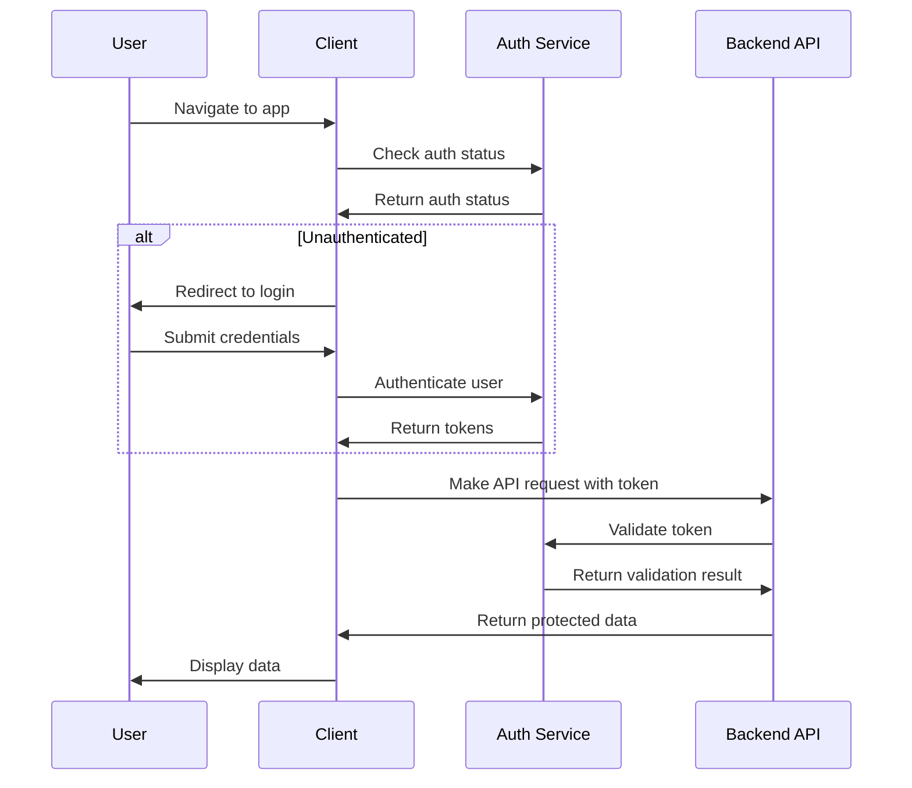

# Backend Architecture

For the MVP of Box Chat AI, we're using a client-side only architecture with Next.js API routes for any server-side processing needs. This approach leverages LobeChat's existing infrastructure while keeping the implementation simple for the initial release.

## Service Architecture

### Serverless Architecture

Next.js API routes provide a serverless architecture that's well-suited for the MVP:

```
src/
├── app/
│   ├── api/
│   │   ├── places/
│   │   │   ├── route.ts        # GET /api/places - Search places
│   │   │   └── [id]/
│   │   │       └── route.ts    # GET /api/places/[id] - Get place by ID
│   │   ├── itineraries/
│   │   │   ├── route.ts        # POST /api/itineraries - Create itinerary
│   │   │   └── [id]/
│   │   │       ├── route.ts    # GET /api/itineraries/[id] - Get itinerary
│   │   │       ├── route.ts    # PUT /api/itineraries/[id] - Update itinerary
│   │   │       └── route.ts    # DELETE /api/itineraries/[id] - Delete itinerary
│   │   └── search/
│   │       └── route.ts        # POST /api/search - Advanced search
│   └── [...]
```

### Function Organization

```typescript
// src/app/api/places/route.ts
import { NextResponse } from 'next/server';
import { Place } from '@/types';

// Load places data (this would be cached in production)
let placesData: Place[] | null = null;

async function loadPlacesData(): Promise<Place[]> {
  if (placesData) {
    return placesData;
  }
  
  try {
    const response = await fetch(process.env.PLACES_JSON_URL || '/data/places.json');
    placesData = await response.json();
    return placesData;
  } catch (error) {
    console.error('Error loading places data:', error);
    throw new Error('Failed to load places data');
  }
}

export async function GET(request: Request) {
  try {
    const { searchParams } = new URL(request.url);
    const query = searchParams.get('query') || '';
    const category = searchParams.get('category') || '';
    const area = searchParams.get('area') || '';
    const priceRange = searchParams.get('priceRange') || '';
    const limit = parseInt(searchParams.get('limit') || '10', 10);
    
    const places = await loadPlacesData();
    
    // Filter places based on criteria
    let filteredPlaces = places;
    
    if (query) {
      const queryLower = query.toLowerCase();
      filteredPlaces = filteredPlaces.filter(place => 
        place.name.toLowerCase().includes(queryLower) ||
        place.category_items.some(cat => cat.toLowerCase().includes(queryLower))
      );
    }
    
    if (category) {
      filteredPlaces = filteredPlaces.filter(place =>
        place.category_items.includes(category)
      );
    }
    
    if (area) {
      const areaLower = area.toLowerCase();
      filteredPlaces = filteredPlaces.filter(place =>
        place.address.district.toLowerCase().includes(areaLower) ||
        place.address.city.toLowerCase().includes(areaLower)
      );
    }
    
    // Limit results
    const limitedPlaces = filteredPlaces.slice(0, limit);
    
    return NextResponse.json({ places: limitedPlaces });
  } catch (error) {
    console.error('Error searching places:', error);
    return NextResponse.json(
      { error: 'Failed to search places' },
      { status: 500 }
    );
  }
}
```

### Function Template

```typescript
// src/app/api/itineraries/route.ts
import { NextResponse } from 'next/server';
import { Itinerary } from '@/types';

// In-memory storage for MVP (would use database in production)
const itineraries: Record<string, Itinerary> = {};

export async function POST(request: Request) {
  try {
    const data = await request.json();
    const { name, places } = data;
    
    // Validate input
    if (!name || !places || !Array.isArray(places)) {
      return NextResponse.json(
        { error: 'Invalid input data' },
        { status: 400 }
      );
    }
    
    // Generate ID (would use proper ID generation in production)
    const id = Date.now().toString();
    const now = new Date().toISOString();
    
    const newItinerary: Itinerary = {
      id,
      name,
      places,
      createdAt: now,
      updatedAt: now,
      estimatedTimes: {}
    };
    
    itineraries[id] = newItinerary;
    
    return NextResponse.json(newItinerary, { status: 201 });
  } catch (error) {
    console.error('Error creating itinerary:', error);
    return NextResponse.json(
      { error: 'Failed to create itinerary' },
      { status: 500 }
    );
  }
}

export async function GET() {
  try {
    return NextResponse.json(Object.values(itineraries));
  } catch (error) {
    console.error('Error fetching itineraries:', error);
    return NextResponse.json(
      { error: 'Failed to fetch itineraries' },
      { status: 500 }
    );
  }
}
```

## Database Architecture

For the MVP, we're using the static `places.json` file and browser storage, but we'll define how this would evolve with a proper database in future phases.

### Schema Design

If we were to use a PostgreSQL database in future phases, the schema would look like:

```sql
-- Places table
CREATE TABLE places (
  id UUID PRIMARY KEY DEFAULT gen_random_uuid(),
  name TEXT NOT NULL,
  category_items JSONB, -- Array of categories
  category_cuisines JSONB, -- Array of cuisines
  address JSONB, -- JSON object with street, district, city
  price_range TEXT,
  rating DECIMAL(3,2),
  open_times JSONB, -- Array of time strings
  created_at TIMESTAMP DEFAULT NOW(),
  updated_at TIMESTAMP DEFAULT NOW()
);

-- Indexes for performance
CREATE INDEX idx_places_category ON places USING GIN (category_items);
CREATE INDEX idx_places_address ON places USING GIN (address);
CREATE INDEX idx_places_rating ON places (rating);

-- Itineraries table
CREATE TABLE itineraries (
  id UUID PRIMARY KEY DEFAULT gen_random_uuid(),
  user_id UUID NOT NULL, -- Reference to user
  name TEXT NOT NULL,
  places JSONB, -- Array of place IDs with additional info
  estimated_times JSONB, -- Place ID to estimated time mapping
  created_at TIMESTAMP DEFAULT NOW(),
  updated_at TIMESTAMP DEFAULT NOW()
);

-- Indexes for performance
CREATE INDEX idx_itineraries_user ON itineraries (user_id);
CREATE INDEX idx_itineraries_created ON itineraries (created_at);
```

### Data Access Layer

```typescript
// services/databaseService.ts
// This would be used in future phases with a proper database

export class DatabaseService {
  static async searchPlaces(criteria: SearchCriteria): Promise<Place[]> {
    // In future with database:
    // 1. Build SQL query based on criteria
    // 2. Execute query with proper indexing
    // 3. Return results
    
    // For now, this is handled by the API route
    throw new Error('Database service not implemented for MVP');
  }
  
  static async createItinerary(itinerary: Omit<Itinerary, 'id' | 'createdAt' | 'updatedAt'>): Promise<Itinerary> {
    // In future with database:
    // 1. Insert itinerary into itineraries table
    // 2. Return created itinerary with ID
    
    // For now, this is handled by the API route
    throw new Error('Database service not implemented for MVP');
  }
  
  static async getItinerary(id: string): Promise<Itinerary | null> {
    // In future with database:
    // 1. Query itineraries table by ID
    // 2. Return result or null if not found
    
    // For now, this is handled by the API route
    throw new Error('Database service not implemented for MVP');
  }
}
```

## Authentication and Authorization

LobeChat already has authentication mechanisms in place, which we'll leverage for Box Chat AI.

### Auth Flow



### Middleware/Guards

```typescript
// middleware/auth.ts
import { NextRequest, NextResponse } from 'next/server';
import { getToken } from 'next-auth/jwt';

export async function authMiddleware(request: NextRequest) {
  const token = await getToken({ req: request });
  
  // If no token and trying to access protected route
  if (!token && request.nextUrl.pathname.startsWith('/api/itineraries')) {
    return NextResponse.json(
      { error: 'Authentication required' },
      { status: 401 }
    );
  }
  
  // Continue with the request
  return NextResponse.next();
}

// Apply middleware in middleware.ts
export { authMiddleware as middleware };
```

This backend architecture uses Next.js API routes for the MVP while defining how it would evolve with a proper database and authentication system in future phases. The design maintains consistency with LobeChat's existing patterns while providing a solid foundation for the new functionality.
