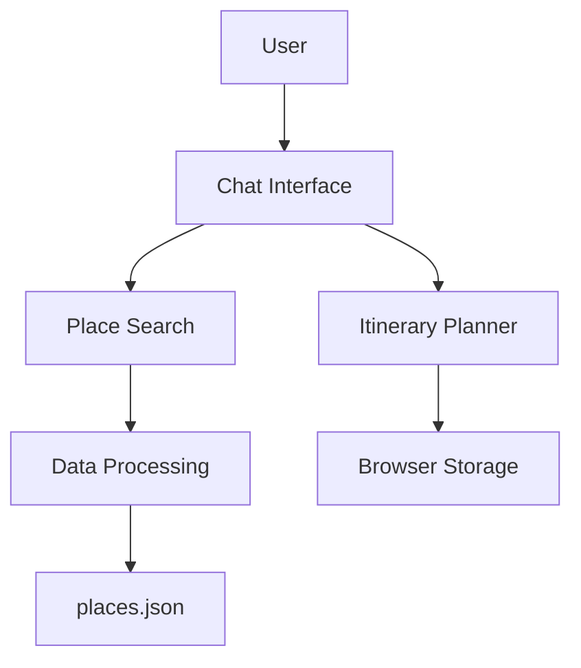

# Components

Based on the architectural patterns, tech stack, and data models defined above, here are the major logical components/services across the fullstack:

## Component List

### Place Search Component
**Responsibility:** Handles natural language processing of user queries and searches the places database to find relevant recommendations.

**Key Interfaces:**
- `searchPlaces(query: string, filters: SearchFilters): Promise<Place[]>`
- `parseUserQuery(query: string): Promise<SearchCriteria>`

**Dependencies:** 
- Places data model
- NLP processing library
- Browser storage for caching

**Technology Stack:** 
- TypeScript for type safety
- Next.js for frontend framework
- Zustand for state management
- Browser storage APIs

### Itinerary Planner Component
**Responsibility:** Manages the creation, modification, and storage of user itineraries.

**Key Interfaces:**
- `createItinerary(name: string, places: Place[]): Promise<Itinerary>`
- `updateItinerary(id: string, updates: Partial<Itinerary>): Promise<Itinerary>`
- `deleteItinerary(id: string): Promise<void>`
- `getItinerary(id: string): Promise<Itinerary>`

**Dependencies:** 
- Itinerary data model
- Place data model
- Browser storage for persistence

**Technology Stack:** 
- TypeScript for type safety
- Next.js for frontend framework
- Zustand for state management
- Browser storage APIs

### Chat Interface Component
**Responsibility:** Integrates with LobeChat to provide a conversational interface for users to interact with the place recommendation and itinerary planning features.

**Key Interfaces:**
- `processUserMessage(message: string): Promise<ChatResponse>`
- `renderPlaceCards(places: Place[]): JSX.Element`
- `renderItinerary(itinerary: Itinerary): JSX.Element`

**Dependencies:** 
- LobeChat core components
- Place Search Component
- Itinerary Planner Component

**Technology Stack:** 
- TypeScript for type safety
- React for UI components
- Ant Design for UI elements
- LobeChat framework

### Data Processing Component
**Responsibility:** Handles the loading, parsing, and processing of the large places.json file.

**Key Interfaces:**
- `loadPlacesData(): Promise<Place[]>`
- `filterPlaces(places: Place[], criteria: SearchCriteria): Place[]`
- `sortPlaces(places: Place[], sortBy: SortOption): Place[]`

**Dependencies:** 
- Places data model
- File system access (for places.json)

**Technology Stack:** 
- TypeScript for type safety
- Next.js for server-side processing (API routes)
- JSON parsing libraries

## Component Diagrams

This component architecture ensures clear separation of concerns while maintaining tight integration with the existing LobeChat platform. Each component has well-defined responsibilities and interfaces, making the system maintainable and extensible for future phases.
