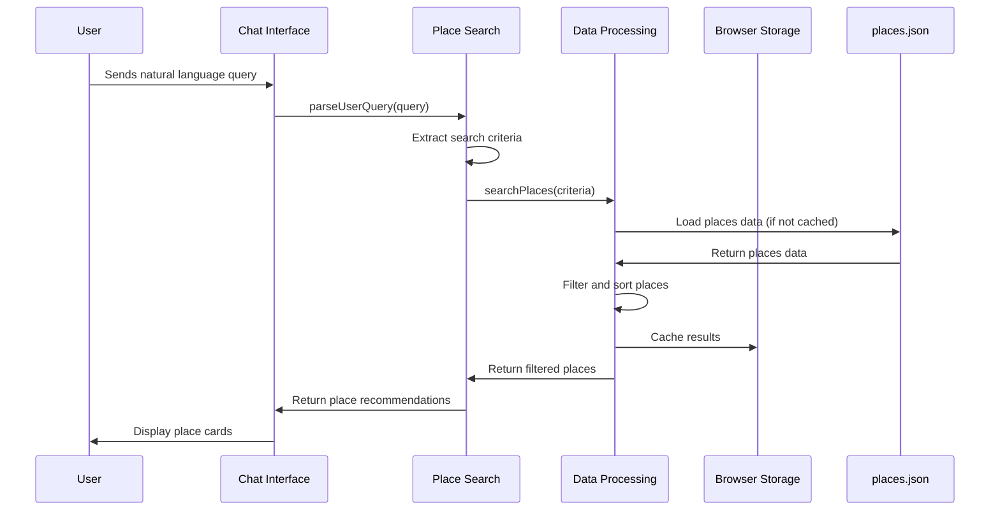
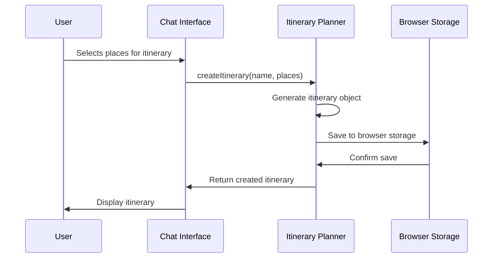
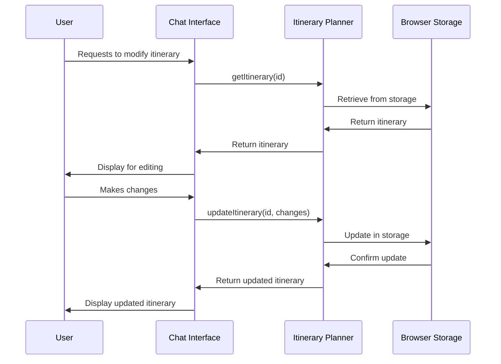

# Core Workflows

The following sequence diagrams illustrate key system workflows for Box Chat AI:

## Place Search Workflow

This workflow shows how a user's natural language query is processed to return place recommendations:

## Itinerary Creation Workflow

This workflow shows how a user creates and manages an itinerary:

## Itinerary Modification Workflow

This workflow shows how a user modifies an existing itinerary:

These workflows demonstrate the core interactions between components and show how data flows through the system. The design ensures that the user experience remains responsive and intuitive while maintaining data consistency.
