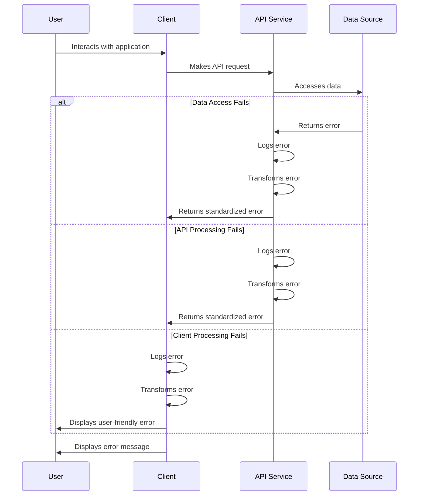

# Error Handling Strategy

A robust error handling strategy is essential for providing a good user experience and maintaining application stability. Here's how we'll handle errors across the Box Chat AI application:

## Error Flow



## Error Response Format

```typescript
interface ApiError {
  error: {
    code: string;
    message: string;
    details?: Record<string, any>;
    timestamp: string;
    requestId: string;
  };
}

// Example error responses
const notFoundError: ApiError = {
  error: {
    code: "PLACE_NOT_FOUND",
    message: "The requested place could not be found",
    timestamp: new Date().toISOString(),
    requestId: "req-12345"
  }
};

const validationError: ApiError = {
  error: {
    code: "VALIDATION_ERROR",
    message: "Invalid input data",
    details: {
      field: "query",
      reason: "Query must be at least 3 characters long"
    },
    timestamp: new Date().toISOString(),
    requestId: "req-12346"
  }
};
```

## Frontend Error Handling

```typescript
// hooks/useErrorHandler.ts
import { useState } from 'react';

export const useErrorHandler = () => {
  const [error, setError] = useState<string | null>(null);
  
  const handleError = (error: any) => {
    // Log error for debugging
    console.error('Application error:', error);
    
    // Set user-friendly error message
    if (error.error?.message) {
      setError(error.error.message);
    } else if (error.message) {
      setError(error.message);
    } else {
      setError('An unexpected error occurred. Please try again.');
    }
  };
  
  const clearError = () => setError(null);
  
  return { error, handleError, clearError };
};

// Example usage in a component
const PlaceSearch = () => {
  const { error, handleError, clearError } = useErrorHandler();
  const [places, setPlaces] = useState<Place[]>([]);
  
  const searchPlaces = async (query: string) => {
    try {
      clearError();
      const results = await placeService.search({ query });
      setPlaces(results);
    } catch (err) {
      handleError(err);
    }
  };
  
  return (
    <div>
      {error && <div className="error-message">{error}</div>}
      <!-- Rest of component -->
    </div>
  );
};
```

## Backend Error Handling

```typescript
// middleware/errorHandler.ts
import { NextRequest, NextResponse } from 'next/server';

export const errorHandler = (error: any) => {
  console.error('API Error:', error);
  
  // Generate request ID for tracking
  const requestId = `req-${Date.now()}-${Math.random().toString(36).substr(2, 9)}`;
  
  // Handle different types of errors
  if (error.name === 'ValidationError') {
    return NextResponse.json({
      error: {
        code: 'VALIDATION_ERROR',
        message: error.message,
        details: error.details,
        timestamp: new Date().toISOString(),
        requestId
      }
    }, { status: 400 });
  }
  
  if (error.name === 'NotFoundError') {
    return NextResponse.json({
      error: {
        code: 'NOT_FOUND',
        message: error.message,
        timestamp: new Date().toISOString(),
        requestId
      }
    }, { status: 404 });
  }
  
  // Default error response
  return NextResponse.json({
    error: {
      code: 'INTERNAL_ERROR',
      message: 'An unexpected error occurred',
      timestamp: new Date().toISOString(),
      requestId
    }
  }, { status: 500 });
};

// Example usage in an API route
export async function GET(request: NextRequest) {
  try {
    // API logic here
    const places = await placeService.search(searchParams);
    return NextResponse.json({ places });
  } catch (error) {
    return errorHandler(error);
  }
}
```

This error handling strategy ensures consistent error management across the application, with clear error flows, standardized error formats, and appropriate handling at both the frontend and backend levels. It provides users with meaningful error messages while preserving technical details for debugging purposes.
