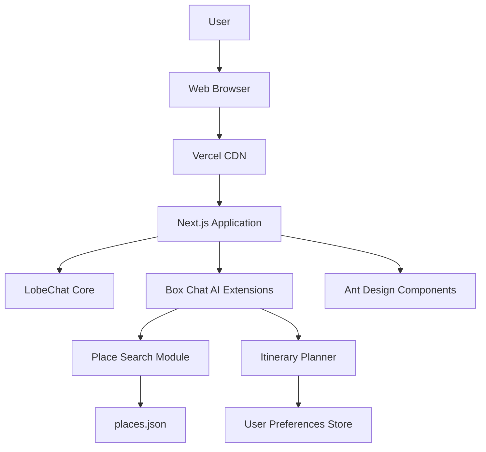

# High Level Architecture

## Technical Summary

Box Chat AI leverages the existing LobeChat platform as its foundation, extending it with place recommendation and itinerary planning capabilities. The architecture follows a client-side only approach for the MVP, with all data processing happening in the browser. The frontend is built with React/Next.js and Ant Design, maintaining consistency with LobeChat's existing UI patterns. Key integration points include the chat interface for natural language input, place card components for displaying recommendations, and itinerary management components for planning. The application will be deployed on Vercel, taking advantage of LobeChat's existing deployment infrastructure. This architecture achieves the PRD goals by providing an intuitive interface for discovering places and creating travel itineraries through natural language interaction.

## Platform and Infrastructure Choice

Based on the PRD requirements and technical assumptions, we'll continue using Vercel as the deployment platform since it's already used by LobeChat. For data storage, we'll use the existing file-based approach with `places.json` stored as a static asset.

**Platform:** Vercel
**Key Services:** 
- Vercel for frontend hosting and serverless functions
- Static file serving for `places.json`
- Vercel Analytics for basic monitoring

**Deployment Host and Regions:** 
- Vercel's global CDN for optimal performance
- Edge functions for any serverless backend needs in future phases

**Rationale:** This approach aligns with LobeChat's existing infrastructure and the MVP's client-side only requirement. It minimizes complexity and development time while leveraging the proven scalability of Vercel's platform.

## Repository Structure

The repository structure will follow LobeChat's existing monorepo approach with some additions for Box Chat AI specific functionality.

**Structure:** Monorepo based on LobeChat's existing structure
**Monorepo Tool:** pnpm workspaces (as used by LobeChat)
**Package Organization:**
- `/apps/web` - Main web application (LobeChat with Box Chat AI extensions)
- `/packages/*` - Shared packages from LobeChat
- `/data` - Location for `places.json` and any other data files
- `/docs` - Documentation including this architecture document

## High Level Architecture Diagram

## Architectural Patterns

- **Component-Based UI:** Reusable React components with TypeScript - _Rationale:_ Maintainability and type safety across large codebases, consistent with LobeChat
- **Client-Side Data Processing:** All data processing happens in the browser - _Rationale:_ Aligns with MVP requirement for no backend and leverages LobeChat's existing architecture
- **Chat-Driven Interface:** Natural language input through chat interface - _Rationale:_ Leverages LobeChat's core strength and provides intuitive user experience
- **State Management Pattern:** Zustand for global state management - _Rationale:_ Already used by LobeChat, provides simple and scalable state management
